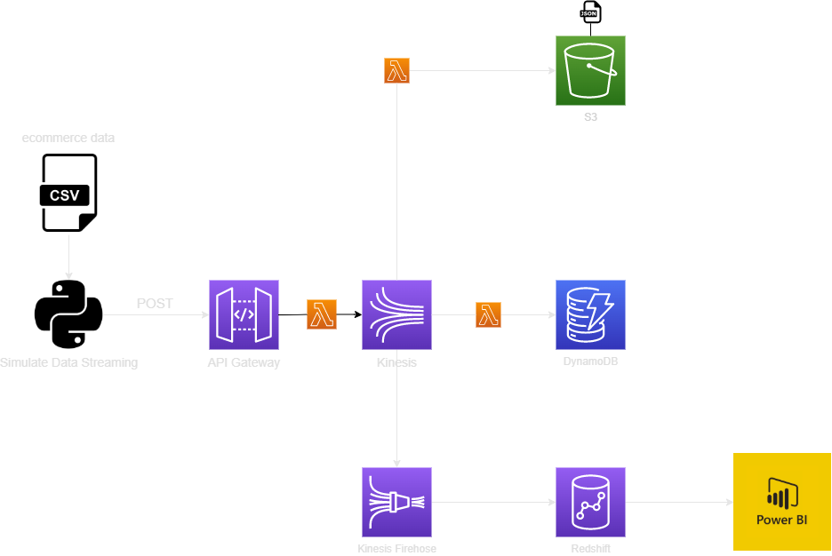
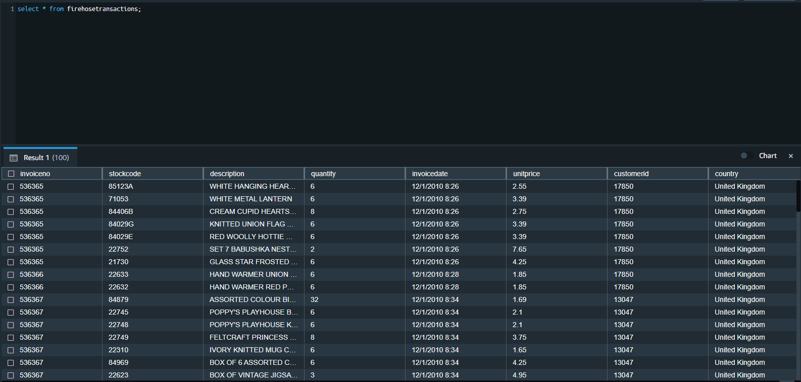
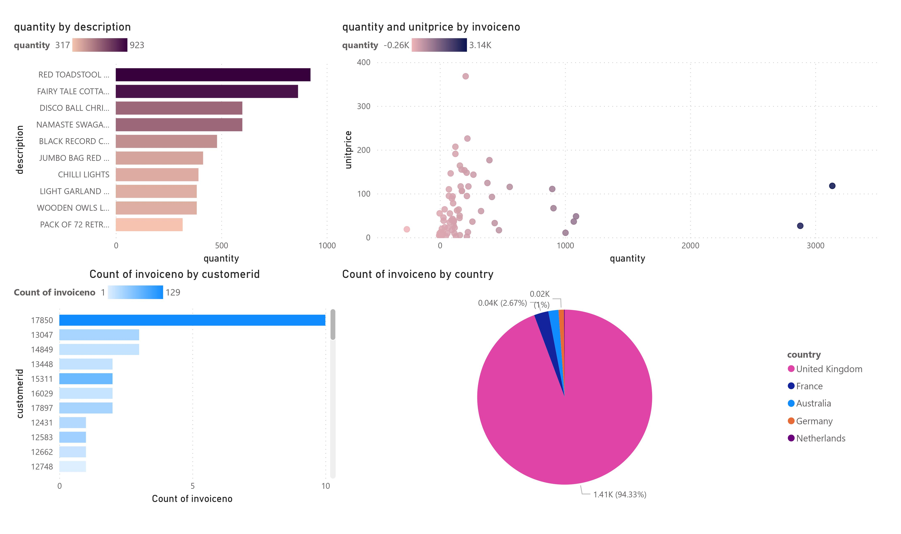

# ecommerce-aws-data-platform

## Project Summary
The objective of this project was to simulate the data streaming process in the aws environment.

## Prerequisites
- AWS
  - API Gateway
  - Lambda
  - Kinesis
  - S3
  - DynamoDB
  - Redshift
- Python
  - requests
  - boto3

## Pipeline

### Data Ingestion Pipeline
I used python to simulate data streaming from an [ecommerce data](https://www.kaggle.com/carrie1/ecommerce-data). I implemented  the POST method for API Gateway in order to ingest the data to Kinesis.

### Kinesis to S3
S3 is being used as a raw data storage. An datalake for the system.
### Kinesis to DynamoDB
This pipeline is mainly created for an OLTP system using DynamoDB.

### Visualization Pipeline
Stream the data into Redshift(data warehouse) to be used as an OLAP system.

Create a dashboard using Power BI with the data from Redshift.

